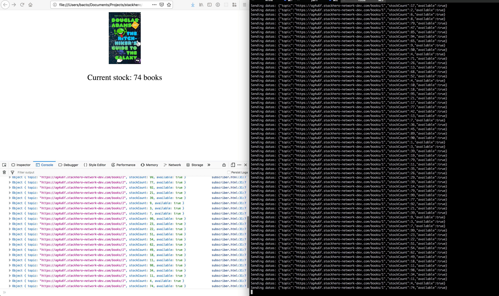

# Mercure Hub: getting started

First you have to create a Mercure Hub service on Stackhero.

In Stackhero's configuration, allow "anonymous subscribers" to let the client connect to topics without authentication.

## Front end

In `frontend/susbcriber.html`, fill the `endpoint` (domain name of Stackhero's service).

Then open the file `susbcriber.html` in your browser.

## Back end

Fill the configuration informations in `backend/.env-example` and rename the file to `.env`.
Then start the server with `npm run start`.

The back end code will send datas every seconds to the Mercure Hub, on a the topic `/books/1`.
The frond end will listen datas from the topic `/books/1` and display them.

Congratulations, you have a Mercure Hub up and running! 🎉