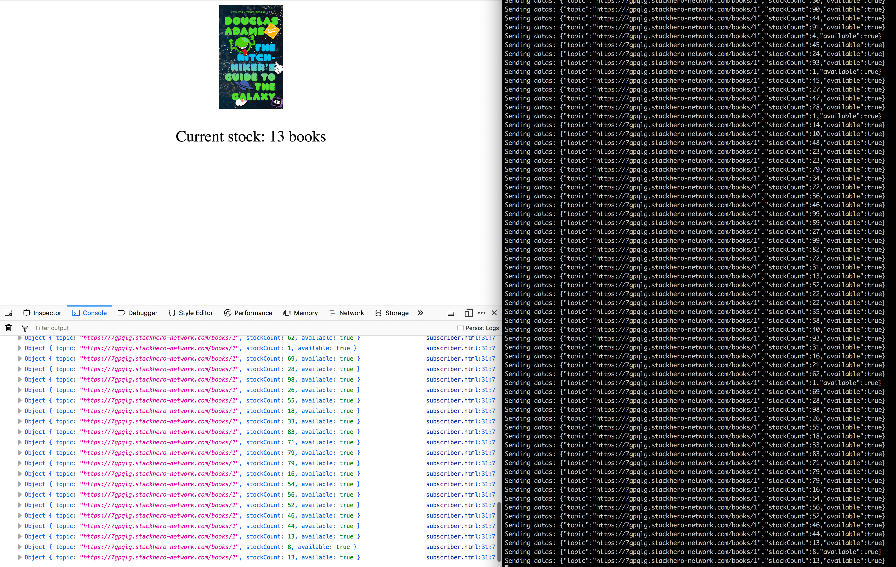

# Mercure-Hub: getting started

## How to send data from Node.js to Mercure-Hub and receive them in the browser

You can find here some examples of Node.js code to send data to a Mercure-Hub server.

These examples are designed to run with a Stackhero Mercure-Hub service.
You'll more informations about Stackhero here:
- [Mercure-Hub cloud](https://www.stackhero.io/en/services/Mercure-Hub/benefits)
- [Mercure-Hub pricing](https://www.stackhero.io/en/services/Mercure-Hub/pricing)
- [Mercure-Hub documentations](https://www.stackhero.io/en/services/Mercure-Hub/documentations)

## How to use

First you have to create a Mercure Hub service on Stackhero.

In Stackhero's configuration, allow "anonymous subscribers" to let the client connect to topics without authentication.

### Front end

In `frontend/susbcriber.html`, fill the `endpoint` (domain name of Stackhero's service).

Then open the file `susbcriber.html` in your browser.

### Back end

Fill the configuration informations in `backend/.env-example` and rename the file to `.env`.
Then start the server with `npm run start`.

The back end code will send datas every seconds to the Mercure Hub, on a the topic `/books/1`.
The frond end will listen datas from the topic `/books/1` and display them.

Congratulations, you have a Mercure Hub up and running! 🎉